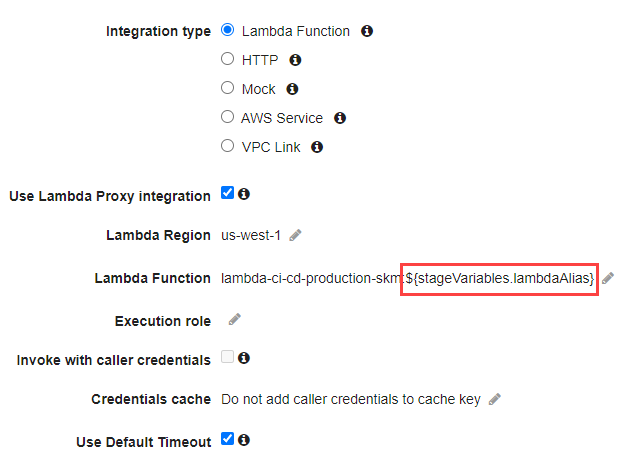
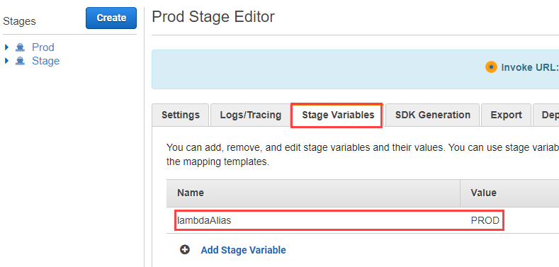

# Rollback configuration

## Create the alias

Create a new alias that will redirect 100% of traffic tagged with the alias to the Function version that the alias points to.

```bash
aws lambda create-alias --function-name lambda-ci-cd-production-skm --name PROD
```

## Configure API gateway

The API Gateway **Lambda Function** integration should reference a stage variable with the Lambda alias.



Configure a stage variable in API Gateway that references the `PROD` alias. It may also be necessary to adjust IAM permissions. Be sure to **Deploy API** again to reflect the configuration changes.



## Perform rollback

In case the version deployed by the CI/CD pipeline fails, the same API Gateway endpoint can change the Function version referenced by the `PROD` alias.

```bash
aws lambda update-alias --function-name lambda-ci-cd-production-skm --name PROD --function-version [PRIOR FUNCTION VERSION]
```
